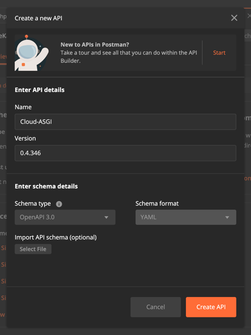
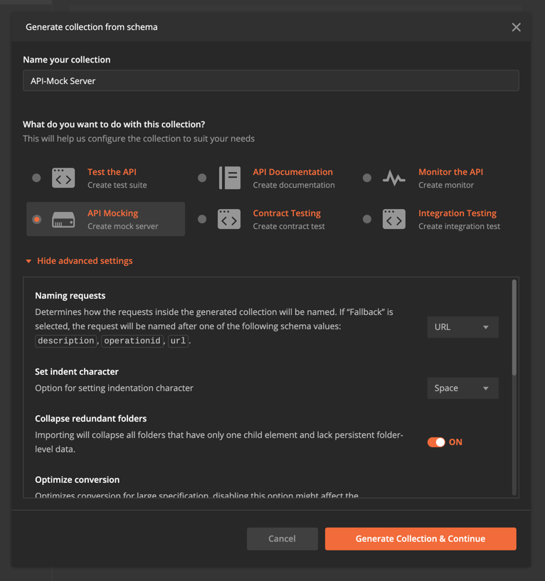

# Unit Testing #

## Notes ##

Creating a starting point to base all and future
Unit Tests is a difficult abstraction to both
implement and understand; however, if the application
team(s) are employing tools that can automate
adherence to, say, `OpenAPI`, functional, unit,
as well as visual testing can be of ease.

The following documentation assumes a few designs.
tools, and standards:

- Postman
- Python Backend
    - Schemas (`dataclasses`)
    - SQL (`postgreSQL`) or noSQL (`mongo`)
    - Auto-Documentation (`fastapi`)
- NodeJS Front-End
    - Carbon
    - React
    - Yarn

Note that when running a backend API server
such as `fastapi`, an OpenAPI document becomes
available for download; this auto-documentation
generation is important as a starting point
for building out Unit Tests. 


Which simply is a bunch of [`json`](./Assets/Open-API.json).
or [`YAML`](./Assets/Open-API.Yaml).

Once downloaded, Postman can create an entire
API to then derive collections for via the
`APIs` Tab: 



And then import the JSON/YAML serialized API.

### Mocking ###

Often times there exist front-end repositories
or components that in some manner need to first
retrieve data; Postman can create API Mock Servers
to faciliatate such development patterns:



Notice that the `{{baseURI}}` is unset; to update this
variable to `https://localhost:3000`, navigate to
`Collections` tab on the main window, click on the
ellipsis, and then update the environment variables to 
reflect the internal or external URI.

Finally, create a Runner and select the Mock
server as the collection.

Either the GUI or a CLI can run the collection
mock server; for CLI

```bash
npm install --global newman
# --- Or on MacOS --- #
brew install newman
```
